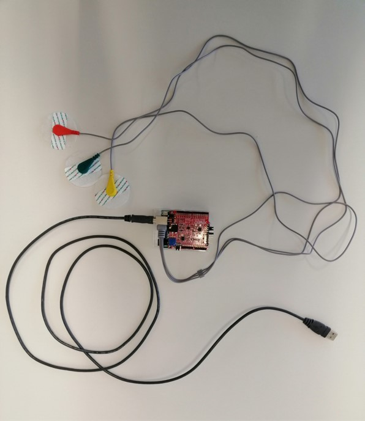

# Measure an ECG with an Arduino Uno and the Olimex-EKG-EMG-Shield and calculate the heart rate variability


For the measurement of the heart-rate-variability it is necessary to measure an ECG first. This is done with three electrodes attached to the left arm, the right arm and the left foot. Those electrodes are the inputs for the Olimex-EKG-EMG-Shield, which is used as a hat for the Arduino Uno Rev3.





## how-to

- Put the Olimex-EKG-EMG-Shield on top of the Arduino

- Attach the Arduino Uno to the computer 

- Upload the [olimex-shield-data-collector.ino](arduino-scripts/olimex-shield-data-collector/olimex-shield-data-collector.ino) to the Arduino

- Plug in the electrodes and attach them to the subject

- Run the [data-receiver.js](nodejs-scripts/data-receiver.js) inside a node.js project

  ```
  npm install serialport
  node data-receiver.js
  ```

- Check if the port is specified correctly in the data-receiver.js script
- An output txt file will be generated 
- Use the file as input for [displayData.m](matlab-scripts/displayData.m)


(simpler version of a ecg plotter: [olimex-serialplotter.ino](arduino-scripts/olimex-serialplotter/olimex-serialplotter.ino)


## ecg signal


## heart-rate-variability


## iir-notch-filter


## r-peak-detection

